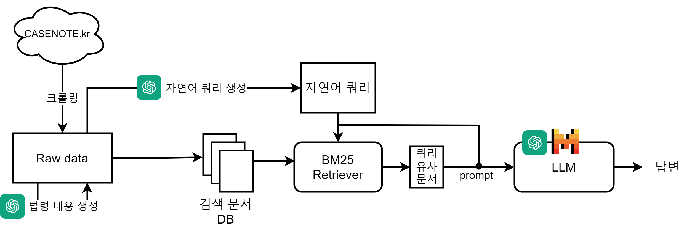

# LegalRAG: A legal consulting chatbot specializing in traffic accidents

>  본 repo는 2024-1학기에 고려대학교에서 진행된 자연어처리(COSE461)수업의 Final Term Project를 아카이브하고자 개설되었습니다.

RAG기술과 LLM을 활용한 교통사고 전문 법률상담 챗봇을 구현했습니다.

그 과정에서 직접 크롤러를 구축하고, BM25 알고리즘을 활용했으며, RAG 기술과 적절한 프롬프트를 통해서 좀 더 정확한 LLM의 답변을 얻을 수 있었습니다. 전체적인 파이프라인은 다음과 같습니다.


GPT-3.5-turbo의 답변을 Groundtruth삼고, [AlphaMist7B](https://huggingface.co/Alphacode-AI/AlphaMist7B-slr-v4-slow2)의 답변을 , RAG 기술을 통하여 파인튜닝 없이도 ROUGE, BLEU에서 다음과 같은 성능 향상을 확인했습니다. (단위: %, n=62)

|    |  | ROUGE-1 | ROUGE-2 | ROUGE-L | BLEU  | BLEU-1  | BLEU-2  |
|----|--------|---------|---------|---------|-------|---------|---------|
| 1  | 쿼리 (RAG  X)| 29.254  | 12.223  | 28.233  | 2.436 | **18.498**  | **10.643**  |
| 2  | 쿼리+판례 | 33.101  | 14.113  | 31.793  | 1.110 | 14.921  |  7.734  |
| 3  | 쿼리+판례+법 | **51.443**  | **30.021**  | **44.855**  | **4.085** | 14.585  |  9.315  |

더불어, LLM이 정확한 법령을 생성하는지를 판단하고자 precision을 활용해 LLM의 할루시네이션 정도를 측정했고, 그 결과 판례와 법령정보 모두를 활용할 때 precision값이 상승하는 것, 즉 할루시네이션이 많이 줄어드는 것을 확인할 수 있었습니다.

|   | |precision | recall | f1 score | # true positive | # false positive | # false negative |
|---|---|--------|--------|----------|-----------------|------------------|------------------|
| 1 | 쿼리 (RAG X) | 0.000   | 0.000  | 0.000    | 0               | 40               | 472              |
| 2 | 쿼리+판례    | 2.040   | 0.211  | 0.383    | 1               | 48               | 471              |
| 3 | 쿼리+판례+법  | **13.297**  | **15.889** | **14.478**   | 75              | 489              | 397              |


좀 더 구체적인 설명과 발표 PPT는 [여기](./assets/자연어처리_15조_RAG를-활용한-법률-상담-시스템-개발.pdf)에서 확인하실 수 있습니다.

<br>

<!-- ## Run demo

1. 먼저 다음과 같은 패키지들을 사전에 설치합니다. 다음 커맨드를 통해서 설치할 수 있습니다.
2.  -->


## Directory Details
- `crawler/` 디렉토리에서는 [casenote.kr](https://casenote.kr/)에서 판례 데이터를 수집하고, 전처리하는 파일들이 담겨있습니다.
    - `crawler/results/` 디렉토리에서 크롤링 및 전처리 단계별 결과물과 최종 결과물을 확인할 수 있습니다.
- `generate_answer/database`에서는 원본 데이터를 기반으로, 자연어 쿼리를 만들고(`query-make.py `), 문서집합에서 유사 문서를 검색하는 과정(`retrieve.py`)에서 사용한 코드가 있습니다.
    - `inference.py`에는 HuggingFace Inference API 혹은 OPENAI API를 활용해 답변을 얻을 수 있습니다. 해당 파일의 결과물은 `generate_answer/database/results`에 저장됩니다.
        - **`final_result.csv`에는 각 실험 프롬프트에 따른 AlphaMist, GPT-3.5의 답변들이 총정리되어 있습니다.**
    - `generate_answer/database/notebooks/` 디렉토리에는 각 실험별로 평가에 필요한 답변 데이터를 만든 실험 노트북들이 담겨있습니다.
        - `evaluate.ipynb` 파일을 통해서 각 실험 결과물에 대한 평가 과정을 확인할 수 있습니다.
```
.
├── crawler/
│   ├── crawling.py
│   └── results/
│       ├── results.csv
│       └── ...  
└── generate_answer/
    ├── inference.py
    ├── metrics.py
    ├── database/
    │   ├── query-make.py
    │   ├── retriever.py
    │   └── datasets/
    │       ├── datasets.csv
    │       └── ...
    ├── notebooks/
    │   ├── evaluate.ipynb
    │   ├── AlphaMist_baseline1.ipynb
    │   ├── ...
    │   ├── GPT_baseline1.ipynb
    │   └── ...
    └── results/
        ├── baseline1_AlphaMist_result.csv
        ├── ...
        └── final_result.csv
```

<br>

## Release History
- 2024.06.13. First submission &  archiving for the final term project
- 2024.06.17. Merged all the repos with git log
- 2024.06.18. Release v1.0, the first version after re-organizing the first submission

### TODO
- [X]  Merge all the repos
- [ ]  Add requirement.txt or setup.py
- [ ]  Add main.py and run.sh with the setup of huggingface and openai API  key


<!-- ## Deployment

Add additional notes about how to deploy this on a live system

## Built With

* [Dropwizard](http://www.dropwizard.io/1.0.2/docs/) - The web framework used
* [Maven](https://maven.apache.org/) - Dependency Management
* [ROME](https://rometools.github.io/rome/) - Used to generate RSS Feeds -->

<br>

## Our team
- [원종빈](https://github.com/Jongbin-kr)
- [Hyeyoung-Eum](https://github.com/Hyeyoung-Eum)
- [bykimby](https://github.com/bykimby)
- [hoonhk20](https://github.com/hoonhk20)

<br>

## License

This project is licensed under the MIT License.

<!-- ## Acknowledgments

* Hat tip to anyone whose code was used
* Inspiration
* etc -->